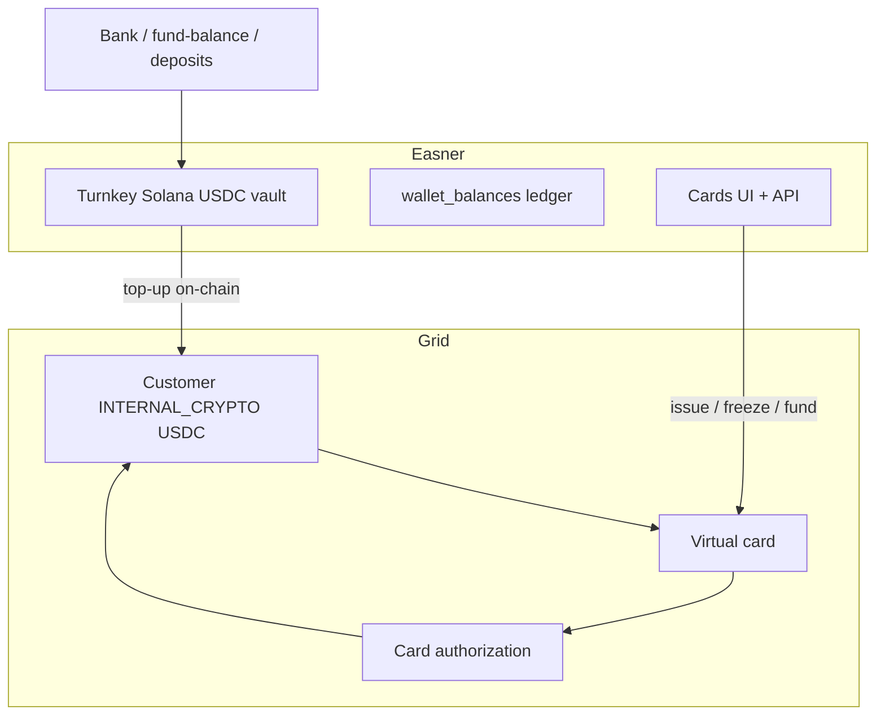

# Grid Virtual Cards: INTERNAL_CRYPTO USDC + Turnkey Top-up

**Status:** Draft plan  
**Last updated:** 2026-08-13  
**Scope:** Corporate virtual cards for Easner business customers, funded by Grid `INTERNAL_CRYPTO` USDC and topped up from Turnkey Solana USDC custody.

---

## Goal

Enable Easner business customers to hold and spend on a **Grid-issued virtual card** without replacing Turnkey as primary USDC custody.

- **Turnkey** remains the send/deposit/payout vault.
- **Grid `INTERNAL_CRYPTO` USDC** is a dedicated **card spend pool**.
- **Top-up** moves USDC on-chain from Turnkey → Grid internal deposit address.
- **Card auths** pull from the Grid internal balance (no Turnkey involvement at auth time).

---

## Non-goals (v1)

- Physical cards (`form: "PHYSICAL"` is not available via Grid API v1).
- `EMBEDDED_WALLET` funding or Spark delegated-keys signing.
- Funding cards directly from Turnkey external accounts (not supported by Grid card API).
- Unified single-balance UX across Turnkey and card pool (defer to v2).
- Per-user cards (v1 is one corporate card per business).

---

## Architecture



### Funding model

| Layer | Role | Source of truth |
|---|---|---|
| Turnkey Solana USDC | Custody, send, payout settlement | Turnkey + Easner ledger |
| Grid `INTERNAL_CRYPTO` USDC | Card spend pool | Grid internal account balance |
| Virtual card | Spend rail | Grid card + `fundingSources` |

Grid card `fundingSources` must be **customer `InternalAccount:` ids** (`INTERNAL_FIAT`, `INTERNAL_CRYPTO`, or `EMBEDDED_WALLET`). Easner uses **`INTERNAL_CRYPTO` USDC** only.

---

## Existing code to reuse

| Capability | Location | Reuse |
|---|---|---|
| Grid HTTP client | `business/lib/grid/http.ts` | All Grid card/internal-account calls |
| Resolve customer internal account | `resolveGridCustomerInternalAccountId()` in `business/lib/grid/quote-request.ts` | Extend for `INTERNAL_CRYPTO` USDC |
| Extract Solana deposit address | `extractGridFundingSolanaAddress()` in `business/lib/grid/external-account.ts` | Read from internal account `fundingPaymentInstructions` |
| Turnkey → Grid on-chain send | `executeGridBalancePayoutTurnkeyLeg()` in `business/lib/grid/payout-execute.ts` | Same send path, different destination |
| Turnkey send primitive | `createTurnkeySend()` (via payout flow) | Card pool top-up |
| Platform USDC internal lookup | `resolveGridPlatformUsdcFundingInstructions()` in `business/lib/grid/quote-funding.ts` | Pattern for per-customer deposit instructions |
| Post-KYB Grid customer | `businesses.grid_customer_id`, `provision-after-approval.ts` | Cardholder = business Grid customer |
| Turnkey external account (payouts) | `business/lib/grid/turnkey-external-account.ts` | **Not** used for card funding |
| Cards UI shell | `business/app/cards/page.tsx` | Wire to new API |
| Cards React Query hooks | `business/hooks/queries/use-cards.ts`, `use-freeze-card.ts` | Already target `/api/business/cards/*` |

---

## New components

### 1. Grid card pool resolver

**Module:** `business/lib/grid/card-pool.ts` (proposed)

```text
resolveGridCustomerUsdcInternalAccount(customerId)
  → GET /customers/internal-accounts?customerId&currency=USDC
  → filter type === INTERNAL_CRYPTO, status === ACTIVE
  → return { internalAccountId, balance, fundingPaymentInstructions }

resolveGridUsdcInternalDepositAddress(internalAccountId)
  → GET /customers/internal-accounts/{id} (or list row)
  → extractGridFundingSolanaAddress({ fundingPaymentInstructions })
```

### 2. Turnkey top-up

**Module:** `business/lib/grid/card-pool-top-up.ts` (proposed)

```text
topUpGridCardPoolFromTurnkey({ admin, businessId, amountUsdc, idempotencyKey })
  1. Resolve Turnkey USDC vault + available balance
  2. Resolve Grid USDC internal deposit address
  3. createTurnkeySend(vault → depositAddress, amount)
  4. Insert tracking row (pending top-up)
  5. On Grid credit (poll or webhook), mark complete
```

Reuse payout Turnkey leg mechanics; only the **destination address** changes:

| Flow | Turnkey destination |
|---|---|
| Balance payout (today) | Quote JIT / platform USDC funding address |
| Card top-up (new) | Customer `INTERNAL_CRYPTO` USDC deposit address |

### 3. Card issuance

**Module:** `business/lib/grid/card-issue.ts` (proposed)

```text
issueGridVirtualCard({ businessId, gridCustomerId, fundingAccountId })
  POST /cards {
    cardholderId: gridCustomerId,
    form: "VIRTUAL",
    fundingSources: [fundingAccountId],
    platformCardId: "easner_biz_{businessId}"
  }
  → persist grid_card_id, state
```

### 4. Card API routes

Implement routes referenced by existing hooks:

| Route | Purpose |
|---|---|
| `GET /api/business/cards` | List cards for business |
| `GET /api/business/cards/[id]` | Card detail |
| `GET /api/business/cards/[id]/controls` | Spending controls |
| `POST /api/business/cards` | Issue card (admin/finance role) |
| `POST /api/business/cards/fund` | Turnkey top-up to card pool |
| `GET /api/business/cards/balance` | Grid internal USDC available balance |
| `POST /api/business/cards/[id]/freeze` | Proxy Grid freeze |
| `POST /api/business/cards/[id]/unfreeze` | Proxy Grid unfreeze |
| `POST /api/business/cards/[id]/reveal` | Proxy Grid PAN reveal (PCI-safe) |

### 5. Webhooks

Extend `business/lib/grid/webhook-processor.ts`:

| Event | Action |
|---|---|
| `card.state_change` | Update local card state (`PROCESSING` → `ACTIVE`, etc.) |
| Transaction `type: "CARD"` | Ingest auth/clearing; show in card transaction list |
| Internal account credit (if emitted) | Complete pending top-up sessions |

### 6. Schema

**Migration:** `business/supabase/migrations/YYYYMMDD_grid_cards.sql` (proposed)

Option A — columns on `businesses`:

```sql
grid_card_funding_account_id text,
grid_card_id text,
grid_card_state text,
grid_card_issued_at timestamptz
```

Option B — dedicated table `grid_cards` (preferred if multiple cards later):

```sql
grid_cards (
  id uuid primary key,
  business_id uuid references businesses(id),
  grid_card_id text not null,
  grid_funding_account_id text not null,
  state text,
  platform_card_id text unique,
  created_at timestamptz
)
```

Option C — top-up tracking:

```sql
grid_card_top_ups (
  id uuid primary key,
  business_id uuid,
  amount_usdc numeric,
  turnkey_tx_signature text,
  status text, -- pending | credited | failed
  grid_internal_account_id text,
  created_at timestamptz
)
```

---

## Ledger / balance UX (v1 decision)

**Recommendation:** Grid-native card balance (Approach A).

- Display **Card balance** from Grid `INTERNAL_CRYPTO` USDC internal account.
- Display **Send balance** from Turnkey / `wallet_balances` separately.
- Top-up is an explicit user action: "Move to card".

Do **not** mirror card spend into `wallet_balances` in v1 — avoids double-debit and sync bugs.

---

## User flows

### Flow 1: Issue card (post-KYB)

```text
1. Business KYB approved → grid_customer_id exists
2. Admin opens Cards → "Get card"
3. Backend resolves INTERNAL_CRYPTO USDC account (or fails with clear error)
4. POST /cards → card enters PROCESSING
5. Webhook → ACTIVE → show card in UI
```

Card can be issued at $0 pool balance; auths decline until funded.

### Flow 2: Fund card pool

```text
1. User enters USDC amount on Cards page
2. Validate Turnkey/wallet available ≥ amount + fee buffer
3. Turnkey send → Grid internal deposit address
4. Poll/webhook until Grid balance increases
5. Show updated card pool balance
```

### Flow 3: Card purchase

```text
1. Merchant authorization
2. Grid pulls from INTERNAL_CRYPTO USDC balance
3. CardTransaction webhook → show in activity
4. No Turnkey involvement
```

### Flow 4: Deposit → optional card funding

```text
Bank/VA/fund-balance → credits ledger + often Turnkey USDC
  → user optionally taps "Fund card"
  → Flow 2
```

---

## Implementation phases

### Phase 0 — Sandbox validation (1–2 days)

**Deliverable:** `business/scripts/probe-grid-card-pool.ts`

Script steps:

1. Accept `--business-id` or `--grid-customer-id`
2. List customer internal accounts; find `INTERNAL_CRYPTO` USDC
3. Print deposit address from `fundingPaymentInstructions`
4. Sandbox fund via `POST /sandbox/internal-accounts/{id}/fund` **or** document address for manual Turnkey send
5. `POST /cards` with `fundingSources: [accountId]`
6. `POST /sandbox/cards/{id}/simulate/authorization` (or equivalent)
7. Print before/after internal account balance

**Exit criteria:**

- [ ] Customer `INTERNAL_CRYPTO` USDC account exists after KYB
- [ ] Deposit instructions include valid Solana address
- [ ] Sandbox fund or Turnkey send credits internal balance
- [ ] Virtual card issues and binds to account
- [ ] Simulated auth debits internal balance
- [ ] Platform credentials can freeze/unfreeze without embedded wallet signing

**Open questions for Grid (block production if unanswered):**

1. Is `INTERNAL_CRYPTO` USDC auto-provisioned for business customers on this platform?
2. Expected credit latency after on-chain deposit to internal account?
3. Card program settlement currency when funded by USDC (USD display vs USDC)?

---

### Phase 1 — Backend primitives (3–5 days)

| Task | Files |
|---|---|
| Card pool resolver | `business/lib/grid/card-pool.ts` |
| Top-up from Turnkey | `business/lib/grid/card-pool-top-up.ts` |
| Card issue helper | `business/lib/grid/card-issue.ts` |
| Extend internal account picker | `quote-request.ts` — optional `type` filter |
| Unit tests | `card-pool.test.ts`, `card-pool-top-up.test.ts` |
| Schema migration | `supabase/migrations/*_grid_cards.sql` |

**Exit criteria:**

- [ ] Can resolve USDC internal account + deposit address for a real business
- [ ] Can execute Turnkey top-up and track pending → credited
- [ ] Can issue virtual card and persist ids
- [ ] Webhook handlers update card state and ingest card transactions

---

### Phase 2 — API + UI wiring (3–5 days)

| Task | Files |
|---|---|
| Cards API routes | `business/app/api/business/cards/**` |
| Wire `/cards` page | `business/app/cards/page.tsx` |
| Fund card dialog | new component |
| Card balance display | Cards page + hook |
| AuthZ | finance/admin roles for issue, fund, freeze |

**Exit criteria:**

- [ ] Existing hooks (`use-cards`, `use-freeze-card`) work end-to-end
- [ ] Business admin can issue, fund, freeze, view balance
- [ ] Card transactions visible in UI

---

### Phase 3 — Production hardening (2–3 days)

| Task | Notes |
|---|---|
| Idempotency | `platformCardId`, Turnkey send idempotency keys |
| Error handling | Insufficient Turnkey balance, missing internal account, card PROCESSING timeout |
| Observability | Log top-up lifecycle; alert stuck `pending` top-ups |
| Notifications | Optional push on card funded, low balance |
| Cron | Reconcile pending top-ups against Grid balance (optional) |

**Exit criteria:**

- [ ] Top-up failures surfaced clearly in UI
- [ ] No duplicate Turnkey sends on retry
- [ ] Card webhook processing idempotent

---

### Phase 4 — Enhancements (post-v1)

- Auto top-up when pool balance < threshold
- Unified balance UX (sub-ledger or merged display)
- Multiple cards per business
- Mobile card UI (currently "coming soon" mock)
- Spending controls UI (MCC limits, velocity)

---

## Design defaults

| Decision | v1 default |
|---|---|
| Cards per business | 1 corporate virtual card |
| Issue timing | After KYB; pool may be $0 |
| Top-up | Manual only |
| Minimum top-up | Turnkey send minimum + Solana fee buffer |
| Cardholder | `businesses.grid_customer_id` (BUSINESS customer) |
| Funding account type | `INTERNAL_CRYPTO` USDC only |
| Balance display | Separate "Card balance" vs "Send balance" |

---

## Risks and mitigations

| Risk | Mitigation |
|---|---|
| No `INTERNAL_CRYPTO` USDC on customer after KYB | Phase 0 probe; escalate to Grid platform config |
| Deposit address missing or wrong shape | Reuse `extractGridFundingSolanaAddress`; add tests for field variants |
| Slow Grid credit after Turnkey send | Pending top-up state + poll with timeout; webhook if available |
| User confusion (two USDC balances) | Clear UI labels; optional "Fund card" CTA |
| Card freeze requires wallet signing | Validate in sandbox with platform creds only |
| PCI for PAN reveal | Proxy reveal API; never store PAN/CVV locally |

---

## Test plan

### Unit

- Internal account picker filters `INTERNAL_CRYPTO` + USDC
- Deposit address extraction from `fundingPaymentInstructions`
- Top-up idempotency key generation

### Integration (sandbox)

- Full probe script run on test business
- Issue → fund → simulate auth → freeze → unfreeze

### Manual (staging/production pilot)

- Real Turnkey send to Grid deposit address
- Small live card auth at test merchant
- Verify webhook delivery and UI updates

---

## Success metrics

- Time from KYB approval to active card < 5 minutes (excluding manual top-up)
- Top-up credited within acceptable SLA (define after Phase 0)
- Zero duplicate Turnkey sends on retry
- Card auth decline rate explainable (insufficient pool balance vs processor errors)

---

## References

- Grid cards API: `POST /cards` — virtual only in v1; `fundingSources` = internal account ids
- Grid sandbox fund: `POST /sandbox/internal-accounts/{accountId}/fund`
- Easner Turnkey provisioning: `business/lib/wallet/turnkey-provisioning.ts`
- Easner balance payout Turnkey leg: `business/lib/grid/balance-payout-execute.ts`, `payout-execute.ts`
