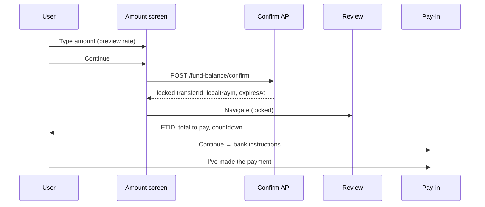
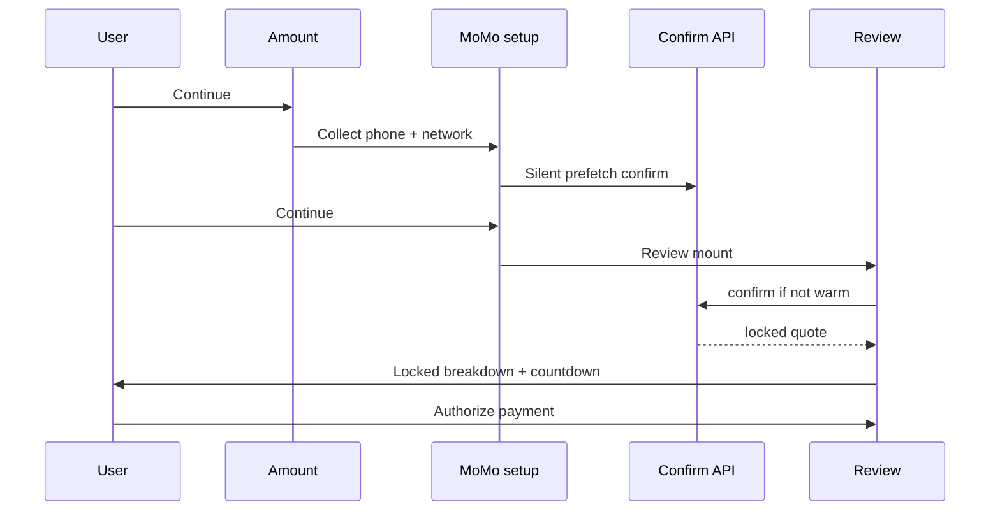
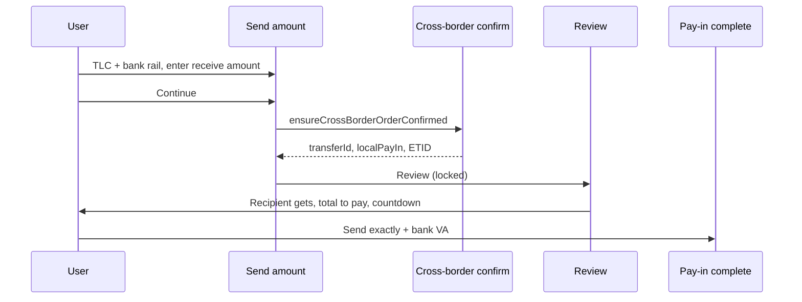
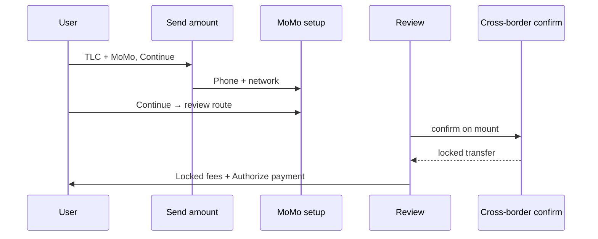
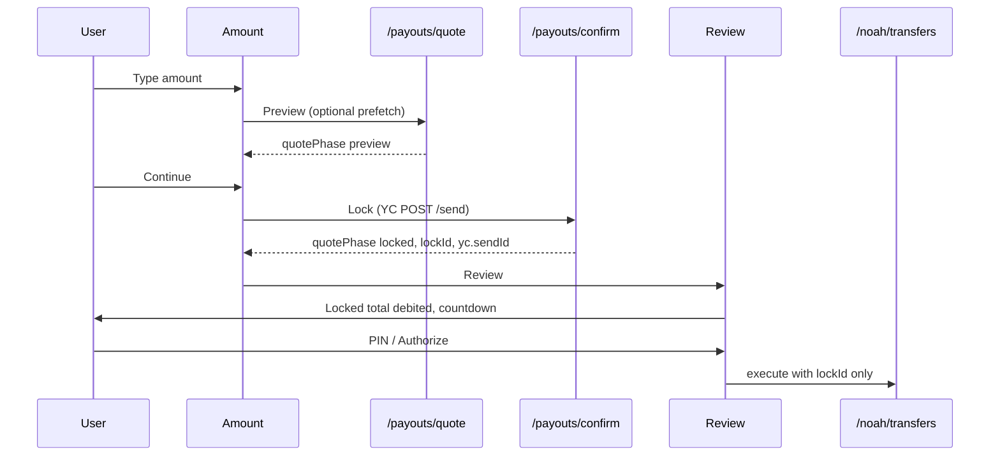
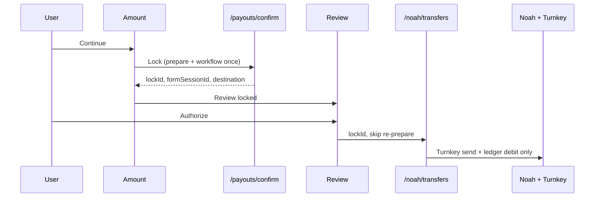
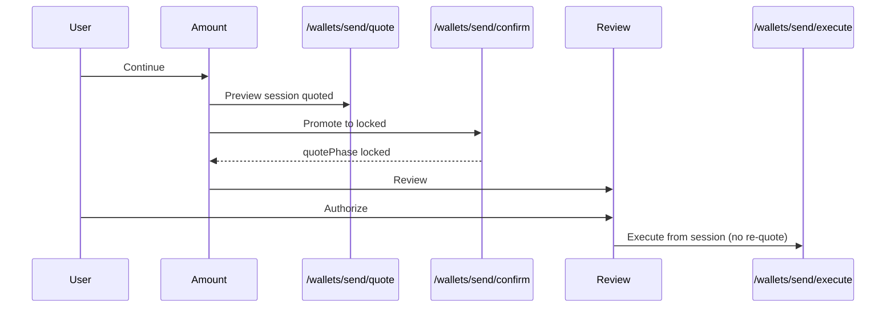
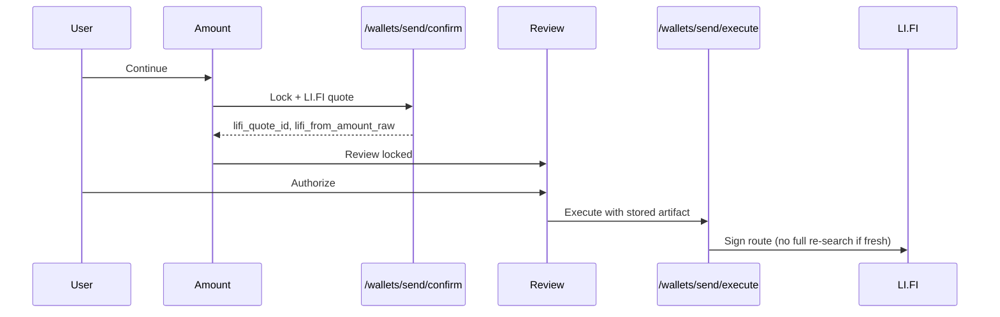
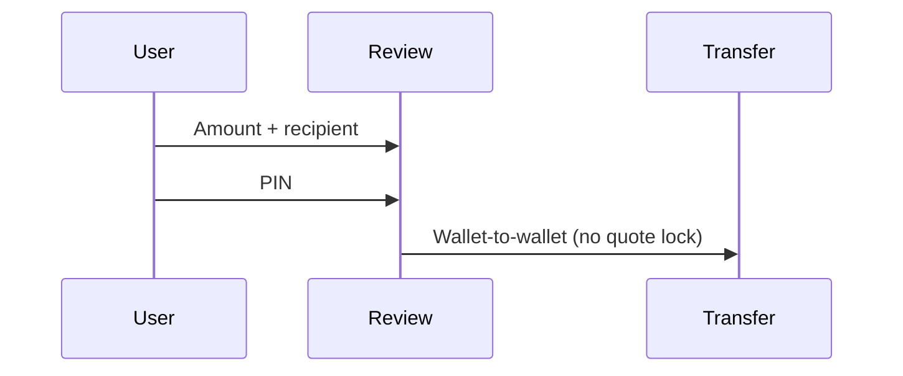

# Lock-on-review UX guide (internal)

Single reference for product, design, and QA on how Easner money flows use **preview → lock → review → execute-only authorize**.

Target mental model: Wise / Revolut / Mercury — one visible wait before review, locked numbers on review, fast authorize.

---

## North-star rules

| Step | User sees | Server does |
|------|-----------|-------------|
| **Amount / setup** | Rate + estimated total while typing; optional silent prefetch | Cheap preview only |
| **Continue → review** | Spinner **only if lock is cold** (175ms delayed on amount Continue) | **Lock** — heavy provider work once |
| **Review** | Locked fees, total debited, ETID when allocated, quote countdown | No new pricing |
| **Authorize / PIN** | Short “Sending…” — no pricing language | Debit + chain/workflow only |

**Accuracy:** Review shows locked rows only when `quotePhase: "locked"` (or equivalent lock artifact) and TTL is valid.

**Expired quote:** Disable CTA; copy: “Quote expired — go back and continue again.”

---

## Master flow comparison

| Flow | Direction | Rail / provider | Lock trigger | Lock API | Execute API | Lock storage |
|------|-----------|-----------------|--------------|----------|-------------|--------------|
| Fund balance pay-in | Receive → balance | YC bank | Amount **Continue** (web + mobile) | `POST /api/yellowcard/fund-balance/confirm` | Pay-in instructions / MoMo authorize | `yc_transfers` |
| Fund balance pay-in | Receive → balance | YC MoMo (web) | **Review mount** (prefetch on MoMo setup) | same | MoMo authorize | `yc_transfers` |
| Fund balance pay-in | Receive → balance | YC MoMo (mobile) | Amount **Continue** (when MoMo ready) | same | MoMo authorize | `yc_transfers` |
| TLC cross-border send | Send (local pay-in) | YC bank | Amount **Continue** | `POST /api/yellowcard/cross-border/confirm` | Bank VA + “I’ve paid” | `yc_transfers` |
| TLC cross-border send | Send (local pay-in) | YC MoMo | **Review / confirm mount** (after MoMo setup) | same | MoMo authorize | `yc_transfers` |
| Balance payout | Send (balance) | YC | Amount **Continue** | `POST /api/payouts/confirm` | `POST /api/noah/transfers` + `lockId` | `payout_lock_sessions` |
| Balance payout | Send (balance) | Noah fiat | Amount **Continue** | `POST /api/payouts/confirm` | same | `payout_lock_sessions` |
| Wallet send | Send (balance) | Turnkey direct | Amount **Continue** | `POST /api/wallets/send/confirm` | `POST /api/wallets/send/execute` | `wallet_send_sessions` (`locked`) |
| Wallet send | Send (balance) | LI.FI bridge | Amount **Continue** | same (+ LI.FI artifact) | same (stored route) | `wallet_send_sessions` |
| Easetag P2P | Send (balance) | Internal | *No lock* | — | Wallet-to-wallet transfer | — |

**MoMo pattern:** Phone + network must exist before lock is meaningful → lock deferred to review (web TLC / web fund-balance MoMo) or after MoMo setup screen (mobile TLC). **Never call `/confirm` while typing on the MoMo setup screen** — each confirm creates a YC transfer keyed by phone number.

---

## Sequence diagrams by corridor

### Fund balance — YC bank pay-in



### Fund balance — YC MoMo (web)



### TLC cross-border — YC bank



### TLC cross-border — YC MoMo



### Balance payout — YC (USD → local)



### Balance payout — Noah (USD/EUR → fiat)



### Wallet send — Turnkey direct



### Wallet send — LI.FI bridge



### Easetag P2P (unchanged)



---

## Client modules (stash + inflight dedup)

| Domain | Web | Mobile |
|--------|-----|--------|
| TLC cross-border | `business/lib/yc-cross-border-quote-cache.ts` | `mobile/src/lib/sendFlowCrossBorderQuote.ts` |
| Fund balance pay-in | `local-deposit-wizard.tsx` + confirm inline | `mobile/src/lib/sendFlowFundBalanceQuote.ts` |
| Balance payout (Noah + YC) | `business/lib/payout-quote-cache.ts` | `mobile/src/lib/sendFlowPayoutQuote.ts` |
| Wallet send | `business/lib/wallet-send-quote-cache.ts` | `mobile/src/lib/sendFlowWalletQuote.ts` |

Shared helpers: `ensure*OrderConfirmed`, `isStashed*Fresh`, `peekLast*Error`.

---

## Shared review UI

| Surface | Component | `phase` |
|---------|-----------|---------|
| TLC + fund balance pay-in | `YcLocalPayInReview` | `preview` \| `locked` |
| Balance payout / wallet (web) | `PayoutReviewDetailsRows` + countdown footer | locked when `quoteReady` |
| Balance payout / wallet (mobile) | `SendConfirmScreen` rows + countdown | locked when session / stash valid |

Locked rows: show ETID when allocated, explicit processing fee breakdown, total debited / total to pay, “Quote valid for X”.

Preview rows: softer estimates; hide txn id where applicable.

---

## Feature flags (balance payout only)

Default **on** per provider (`business/lib/payout/payout-lock-flags.ts`):

| Env | Effect |
|-----|--------|
| `PAYOUT_LOCK_ON_REVIEW=false` | Disable all balance payout lock-on-review |
| `PAYOUT_LOCK_ON_REVIEW_NOAH=false` | Noah payout only |
| `PAYOUT_LOCK_ON_REVIEW_YELLOWCARD=false` | YC balance payout only |
| `PAYOUT_LOCK_ON_REVIEW_WALLET=false` | Wallet send only |

TLC and fund-balance pay-in are **not** gated by these flags.

---

## Database prerequisites

| Table | Used by |
|-------|---------|
| `payout_lock_sessions` | Noah + YC balance payout lock (`business/scripts/sql/payout-lock-sessions-schema.sql`) |
| `wallet_send_sessions` | Wallet quote → locked → execute |
| `yc_transfers` | Fund balance + TLC pay-in locks |

Apply `payout_lock_sessions` migration before testing balance payout confirm in staging.

---

## QA runbooks

| Area | Doc |
|------|-----|
| Balance payout (Noah, YC, Turnkey, LI.FI) | [balance-payout-ux-runbook.md](./balance-payout-ux-runbook.md) |
| TLC cross-border | [cross-border-tlc-test-runbook.md](./cross-border-tlc-test-runbook.md) |
| Direct local transfer (legacy) | [direct-local-transfer.md](./direct-local-transfer.md) |

### Quick smoke checklist

- [ ] Amount Continue: spinner only when stash cold
- [ ] Review: no fee drift vs lock response
- [ ] Countdown visible; expired disables CTA
- [ ] Authorize: no second `/confirm`, `/quote`, or YC `/send` in network log
- [ ] Recipient edit after lock → forced re-confirm or clear error
- [ ] TLC + fund balance regressions unchanged

---

## Automated tests

```bash
# Balance payout lock completion
cd business && npm test -- lib/payout/confirm-payout-order.test.ts lib/yellowcard/payout-quote.test.ts

# Shared pay-in review rows
cd packages/shared && npm test -- src/yc-local-pay-in-rows.test.ts
```

---

## Implementation map (key files)

| Area | Files |
|------|-------|
| Payout confirm router | `business/lib/payout/confirm-payout-order.ts` |
| Payout lock persistence | `business/lib/payout/payout-lock-session.ts` |
| Noah execute-only | `business/lib/noah/turnkey-offramp-orchestration.ts` |
| YC payout execute-only | `business/lib/yellowcard/balance-payout-execute.ts` |
| Wallet confirm | `business/lib/wallet-send/confirm-wallet-send-order.ts` |
| Web send flow | `business/app/send/page.tsx`, `business/app/send/confirm/page.tsx` |
| Mobile send flow | `mobile/src/screens/send/SendAmountScreen.tsx`, `SendConfirmScreen.tsx` |
| Fund balance (web) | `business/components/local-deposit-wizard.tsx` |
| Fund balance (mobile) | `mobile/src/screens/receive/ReceiveLocalAmountScreen.tsx` |
