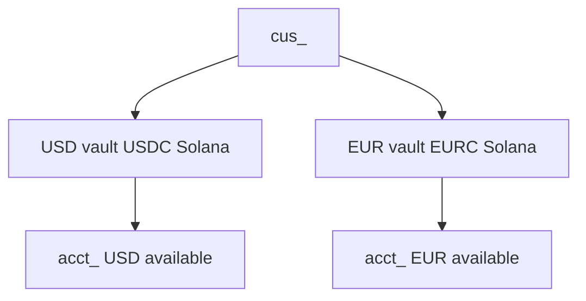

An account is not a float you invent and not money Easner takes onto its own balance. It is the **USD or EUR view** of that customer’s isolated vault.

Creating a [customer](/customers) issues USD. Open EUR with `POST /v1/accounts` and the `cus_` id. Both currencies sit on the **same customer vault owner** — two ledger views, two on-chain vaults.

| `currency` | Stablecoin | Chain | What `available` means |
|---|---|---|---|
| `USD` | USDC | Solana | USDC in the USD vault, in cents |
| `EUR` | EURC | Solana | EURC in the EUR vault, in cents |

The vault is isolated to that customer. You never receive a key. Deposit addresses and bank details are issued against this vault. The customer authorizes send from their vault. `available` is that vault, in cents.



Checkout does **not** credit these accounts. Checkout collects onto your business balance. [Receive](/receive) credits the `acct_` you pass.

In Console, Accounts is the vault inspector for the current Test or Live mode: `available`, deposit instructions, and the wallet QR.

<Note>
  **Scope:** `GET` needs `accounts.read`. `POST` needs `accounts.write`.
</Note>

## Object

| Field | Type | Notes |
|---|---|---|
| `id` | string | `acct_…` |
| `currency` | string | `USD` or `EUR` |
| `available` | integer | Cents you can send from this vault |
| `pending` | integer | Cents not yet available |
| `customer` | string | `cus_…` |
| `livemode` | boolean | |

```json
{
  "id": "acct_…",
  "currency": "USD",
  "available": 4900,
  "pending": 0,
  "customer": "cus_…",
  "livemode": false
}
```

`available: 4900` is **$49.00 of USDC** in that customer’s USD vault.

## How money gets into the vault

Three Receive rails, one balance.

| Rail | What you publish | What arrives in the vault | `transaction.type` |
|---|---|---|---|
| **Virtual account** | ACH / SEPA details | Fiat converts to USDC or EURC, then lands in the vault | `deposit` |
| **Wallet address** | Solana token account | USDC or EURC sent on-chain | `chain` |
| **Card onramp** | Hosted session URL | Card funds the same vault | `onramp` |

The virtual account is **not** a second balance. It is a bank front door onto this vault. The payer sends dollars or euros. Easner converts to the vault stablecoin and credits `available`. Same `acct_`. See [Receive](/receive).

The wallet address is the vault’s **token account** for that asset (USDC for USD, EURC for EUR). A chain payment to that address is a direct credit. No conversion.

Easetag is **not** an account rail. It is a send payment method (and a first-party handle). You do not get an `@tag` on `GET /v1/accounts`.

## List

```bash
curl https://api.easner.com/v1/accounts \
  -H "Authorization: Bearer $EASNER_SECRET_KEY"
```

Issued accounts only. Filter with `?customer=cus_…`. Newest first. Up to 100. There is no next page.

## Open

`POST /v1/accounts` with `{ "currency": "USD", "customer": "cus_…" }`.

```bash
curl https://api.easner.com/v1/accounts \
  -H "Authorization: Bearer $EASNER_SECRET_KEY" \
  -H "Content-Type: application/json" \
  -d '{"currency":"EUR","customer":"cus_…"}'
```

`201` and the account. Opening the same currency for the same customer returns the existing account (same vault).

`400` `invalid_currency` if `currency` is missing. `400` `invalid_customer` if `customer` is missing. `404` if the customer is not on this key. Deposit restrictions return `403`.

## Retrieve

`GET /v1/accounts/:id` → Account. `404` if the id is not on this key.

## Rails on an account

| Call | Job |
|---|---|
| `GET /v1/accounts/:id/deposit_instructions` | Virtual-account bank details for this vault |
| `GET /v1/accounts/:id/deposit_addresses` | Chain token account for this vault |
| `POST /v1/accounts/:id/onramp_sessions` | Hosted card onramp onto this vault |

Live bank details, chain addresses, and onramp require the customer’s [KYC](/customers#start-kyc) (`verification_status = approved`). Test skips that.

## Events

| Event | When |
|---|---|
| `account.updated` | `available` or `pending` changed |
| `transaction.created` | A credit or debit was written |
| `payment.available` | Checkout funds became usable on **your** business balance |

## Expected

- Treat `available` as vault inventory, not a synthetic book.
- Read `available` before you quote a send.
- Pass `customer` on every create.
- Do not treat Checkout settlement as a credit to this `acct_`.
