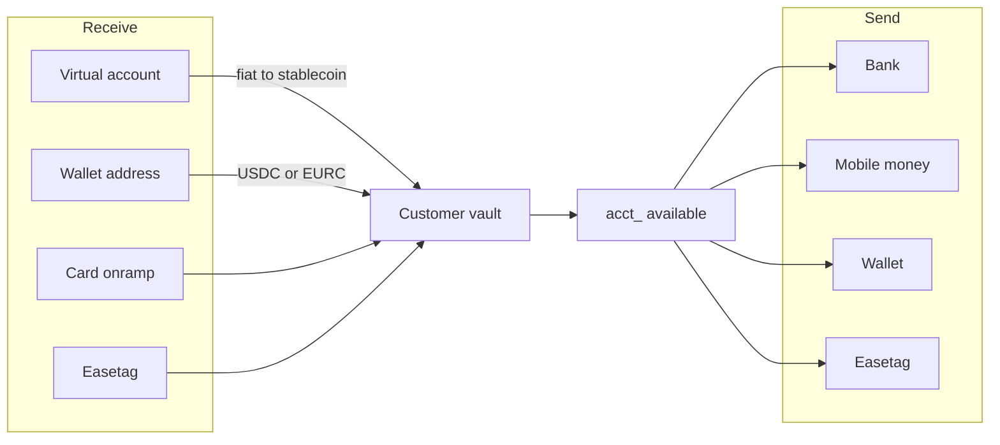

Easner is **stablecoin-native banking and payment infrastructure**. You integrate. Your customer is the banking end user (`cus_`). A payer is someone who pays you through Checkout.

Every issued account is a **custodial stablecoin vault** with a currency view:

| Account | Vault asset | Chain |
|---|---|---|
| USD `acct_` | USDC | Solana |
| EUR `acct_` | EURC | Solana |

You never hold signing keys. You call `v1`. Easner signs. Fiat in (virtual account) converts into that vault. Fiat and chain out leave from that vault. `available` is the vault, in cents.

Base URL: `https://api.easner.com`

Auth: `Authorization: Bearer easner_sk_test_…` or `easner_sk_live_…`

Amounts are minor units (cents). Errors are `{ error: { type, code, message } }`. Writes that move money take `Idempotency-Key`.

## Two products

| Product | Who holds the money | What you build |
|---|---|---|
| **Banking** | Your customer, in their vault (`acct_`) | [Accounts](/accounts), [Receive](/receive), [Send](/send) |
| **Checkout** | You, on your business balance | [Collect](/checkout) on your website |

They share a secret key and Console. They do not share a balance.

Checkout uses the same Connect account as invoices and payment links. A collect lands on **your** business balance — not a customer vault. That is not Receive.

## What `v1` covers

| Rail | On `v1` |
|---|---|
| Customer vault (USDC / EURC) | Yes — created with the customer |
| Receive: virtual account | Yes — live after verification |
| Receive: wallet address | Yes — Solana USDC / EURC |
| Receive: card onramp | Yes — test completes on the hosted page; live opens card onramp onto the vault |
| Receive: Easetag | Yes — the `cus_` has an `@tag`. Inbound credits the issued `acct_` |
| Send: wallet (Solana USDC / EURC) | Yes |
| Send: Easetag | Yes — pays a first-party `@tag` or another `cus_` |
| Send: bank / mobile money | Yes — live leaves the customer vault on the corridor catalog |
| Country / corridor catalog | Yes — `GET /v1/payment_methods` |
| Checkout | Yes — your business balance |

## How you integrate

You map **your user → `cus_` → `acct_`**. Then you either fund the vault (Receive) or pay from it (Send), or you collect onto yourself (Checkout).

<Steps>
  <Step title="Create the customer">
    `POST /v1/customers` with your `external_id`. This issues a USD vault and account. Open EUR with `POST /v1/accounts`.
  </Step>
  <Step title="Verify before live rails">
    `POST /v1/customers/:id/verification`. Test approves immediately. Live returns a hosted URL. A name and email alone cannot hold a named virtual account.
  </Step>
  <Step title="Receive into the vault">
    Publish [bank details](/receive#virtual-account), a [wallet address](/receive#wallet-address), or a [card onramp](/receive#card-onramp). When the deposit settles, `available` rises. Listen for `account.updated` and `transaction.created`.
  </Step>
  <Step title="Send from the vault">
    Create a [destination](/destinations) (bank, mobile money, wallet, or Easetag). [Quote](/quotes) with `source`. [Transfer](/transfers). Fulfil from `transfer.completed`.
  </Step>
  <Step title="Collect on your site">
    Optional. [Checkout](/checkout) sessions credit **your** business balance. Fulfil from `checkout.completed`.
  </Step>
</Steps>

## Objects

| Object | Id | Product | Job |
|---|---|---|---|
| Customer | `cus_` | Banking | Your end user. Owns the vault |
| Account | `acct_` | Banking | Currency view of that vault |
| Destination | `dest_` | Banking | Payment method for a send |
| Quote | `qt_` | Banking | Locked send / receive amounts |
| Transfer | `tr_` | Banking | Money leaving the vault |
| Transaction | `txn_` | Both | Activity on `GET /v1/transactions` |
| Checkout session | `cs_` | Checkout | A collect on your website |

<Columns cols={2}>
  <Card title="Accounts" icon="wallet" href="/accounts">
    The vault, USD/EUR, and how `available` is the stablecoin.
  </Card>
  <Card title="Receive money" icon="download" href="/receive">
    Virtual account, wallet address, card onramp.
  </Card>
  <Card title="Send money" icon="send" href="/send">
    Bank, mobile money, wallet, and Easetag.
  </Card>
  <Card title="Quickstart" icon="rocket" href="/quickstart">
    First send in test.
  </Card>
</Columns>
