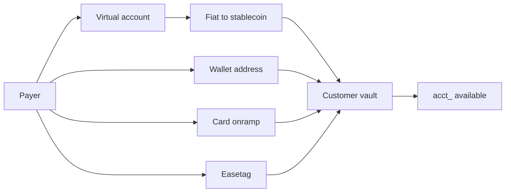

Receive credits your customer’s **stablecoin vault**. The `acct_` `available` balance is that vault.

It is not Checkout. Checkout is online payments on your website; those funds land on **your** business balance.



Live virtual accounts, live wallet addresses, and onramp require hosted [verification](/customers#start-verification) on that `cus_` — KYC for a person, KYB for a business, on **your** app. Your KYB in Banking Settings is access to Easner. It does not approve the customer. A `cus_` with only email and name cannot be issued a **named** virtual account. Test skips customer verification.

<Note>
  **Scope:** `GET` needs `accounts.read`. Verification and onramp need `accounts.write`.
</Note>

## Path

<Steps>
  <Step title="Create the customer">
    `POST /v1/customers` issues the USD vault and `acct_`. Save both ids.
  </Step>
  <Step title="Start verification">
    `POST /v1/customers/:id/verification` with `{ "return_url": "https://…" }`. Test returns `{ "status": "approved", "url": null }`. Live returns a hosted KYC or KYB `url` for them to complete on your app. See [Customers](/customers).
  </Step>
  <Step title="Wait for approved">
    Poll `GET /v1/customers/:id` or handle `customer.updated`. Live Receive returns `403` `verification_required` until `approved`.
  </Step>
  <Step title="Publish one rail">
    Virtual account, wallet address, card onramp, or the customer’s Easetag.
  </Step>
</Steps>

## Virtual account

A virtual account is **bank details that settle into the vault**. The payer uses ACH (USD) or SEPA (EUR). They never see a chain address. Easner converts the fiat to USDC or EURC and credits the same `acct_`.

```bash
curl https://api.easner.com/v1/accounts/acct_…/deposit_instructions \
  -H "Authorization: Bearer $EASNER_SECRET_KEY"
```

USD:

```json
{
  "type": "bank",
  "currency": "USD",
  "account_holder": "Ada",
  "account_number": "000123456789",
  "routing_number": "110000000",
  "bank_name": "Easner Test Bank",
  "country": "US"
}
```

EUR uses `iban` and `bic` instead of account and routing numbers.

| Mode | Result |
|---|---|
| Test | Sandbox numbers. No customer verification. Nothing moves on a real bank |
| Live | Named details after `approved`. Destination is this customer’s vault, not yours. `409` `not_available` if provisioning is not ready |

Show these details in your app. When the bank deposit settles:

1. Fiat arrives on the virtual account.
2. It converts to the vault stablecoin (USDC or EURC).
3. That stablecoin lands in the customer vault.
4. `available` rises. You get `account.updated` and `transaction.created` with `type: "deposit"`.

Do not credit your own product from the HTTP GET. Fulfil from the webhooks.

## Wallet address

A wallet address is the vault’s **token account** on Solana. Someone who already holds USDC or EURC sends it on-chain. No conversion. The same `acct_` credits.

```bash
curl https://api.easner.com/v1/accounts/acct_…/deposit_addresses \
  -H "Authorization: Bearer $EASNER_SECRET_KEY"
```

```json
{
  "data": [
    {
      "currency": "USD",
      "network": "solana",
      "address": "…",
      "asset": "USDC"
    }
  ]
}
```

| Field | Meaning |
|---|---|
| `currency` | The `acct_` ledger (`USD` or `EUR`) |
| `asset` | `USDC` for USD, `EURC` for EUR |
| `network` | `solana` |
| `address` | Token account to send to |

Live requires `approved`. An inbound transfer to that address credits the account (`type: "chain"`).

Publish `address` + `asset` + `network`. Do not ask the payer to send to a bank routing number on this rail.

## Card onramp

Card onramp funds the **same vault** from a card. Destination is the issued `acct_`, not your Banking user.

```bash
curl https://api.easner.com/v1/accounts/acct_…/onramp_sessions \
  -H "Authorization: Bearer $EASNER_SECRET_KEY" \
  -H "Content-Type: application/json" \
  -d '{
    "amount": 2500,
    "currency": "usd",
    "return_url": "https://yoursite.com/funded"
  }'
```

```json
{
  "id": "ors_…",
  "status": "open",
  "amount": 2500,
  "currency": "USD",
  "livemode": false,
  "url": "https://business.easner.com/receive/onramp/ors_…"
}
```

Send your customer to `url`.

| Mode | Result |
|---|---|
| Test | The hosted page completes and credits the account (`type: "onramp"`) |
| Live | Session after `approved`. The hosted `url` opens card onramp onto this vault. `account.updated` and `transaction.created` (`type: "onramp"`) fire when it settles |

`400` `invalid_amount` if `amount` is missing.

## Easetag

Easetag is an **in-network handle** (`@ada`). Creating a customer allocates one. Pass `"easetag": "ada"` on `POST /v1/customers` or accept the allocated tag on the Customer object.

Someone who pays that tag (first-party Banking or another `v1` transfer) credits this customer’s `acct_` (`type: "easetag"`). The tag is unique across Banking users, businesses, and `cus_` records.

```json
{ "id": "cus_…", "easetag": "ada", "verification_status": "approved" }
```

Publish `@` + `easetag`. To pay a tag from `v1`, create a destination `{ "type": "easetag", "details": { "easetag": "ada" } }` and transfer. See [Send](/send#easetag).

## What this is not

| Product | Lands on |
|---|---|
| Receive (`deposit` / `chain` / `onramp` / `easetag`) | Customer vault (`acct_` with `customer`) |
| Checkout | **Your** business balance (website payments) |

Do not send your customer to first-party Banking screens or unpublished `/api` paths. In **test**, Console Accounts → **Simulate test deposit** credits the vault without `/v1` (not available in live).

## Errors

| Code | HTTP | When |
|---|---|---|
| `verification_required` | 403 | Live call before `approved` |
| `not_available` | 403 / 409 | Live details or card session not ready |
| `not_found` | 404 | Unknown `cus_` / `acct_` |
| `invalid_amount` | 400 | Onramp amount missing or not a positive integer |

## Events

| Event | When |
|---|---|
| `customer.updated` | `verification_status` changed |
| `account.updated` | Vault `available` changed |
| `transaction.created` | `deposit`, `onramp`, `chain`, or `easetag` credit |

<Card title="Send money" icon="send" href="/send">
  Pay out from the same vault.
</Card>
