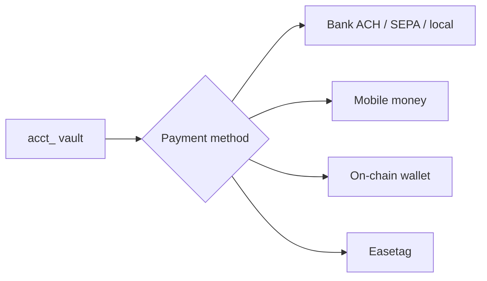

Send **debits the customer vault**. `available` on the source `acct_` is USDC or EURC. The destination type is the **payment method** — how the recipient gets paid.



<Note>
  **Scope:** `GET` needs `accounts.read`. Creates need `transfers.write`.
</Note>

## Path

<Steps>
  <Step title="Fund the vault">
    `available` must cover the send. Fund with [Receive](/receive), or keep the first send in test.
  </Step>
  <Step title="Create a destination">
    One payment method. [Destinations](/destinations) stores the rail details.
  </Step>
  <Step title="Quote">
    `POST /v1/quotes` with **`source`** (the `acct_`) and `destination`. Lock send and receive. Expire in 15 minutes.
  </Step>
  <Step title="Transfer">
    `POST /v1/transfers` with `{ "quote": "qt_…" }` and `Idempotency-Key`.
  </Step>
  <Step title="Fulfil from webhooks">
    `transfer.completed` and `transaction.created`. Do not treat HTTP `201` as “the recipient has the money” if your product can retry.
  </Step>
</Steps>

## Payment methods

| `type` | What the recipient sees | Typical method label |
|---|---|---|
| `bank` | Bank credit | **ACH** (US/USD), **SEPA Instant** (EUR), **Faster Payments** (GB/GBP), otherwise **local transfer** |
| `mobile_money` | Mobile-money wallet | Local transfer (M-Pesa, MTN, and other networks you pass) |
| `wallet` | On-chain address | USDC, USDT, or EURC on the network you pass |
| `easetag` | An Easner `@tag` | In-network, another Easner user |

Create the destination first, then quote. The quote’s `send` is what leaves the vault. `receive` is what the destination should get. In test, send and receive are 1:1. In live, a **wallet** destination may price fees into a higher `send.amount`. Always debit `send.amount`.

### Bank

Use when the recipient wants dollars or euros (or local currency) in a bank account.

US / ACH:

```json
{
  "type": "bank",
  "customer": "cus_…",
  "details": {
    "account_number": "…",
    "routing_number": "…",
    "bank_name": "…",
    "country": "US",
    "checking_or_savings": "checking"
  }
}
```

EUR / SEPA:

```json
{
  "type": "bank",
  "details": {
    "iban": "…",
    "bic": "…",
    "account_holder": "…",
    "bank_name": "…",
    "country": "DE"
  }
}
```

Also accepted on `details` when the corridor needs them: `sort_code`, `swift_bic`, `account_holder`.

The vault (USDC or EURC) is sold into fiat on the rail. You do not pick ACH vs SEPA as a separate API type — country and currency on the destination select the method.

### Mobile money

Use when the recipient is on a mobile-money network.

```json
{
  "type": "mobile_money",
  "details": {
    "phone": "+2547…",
    "network": "mpesa",
    "country": "KE"
  }
}
```

`network` is the operator (for example `mpesa`, `mtn`). Pass the country as ISO-2.

### Wallet

Use when the recipient wants stablecoins at an address they already control.

```json
{
  "type": "wallet",
  "details": {
    "address": "…",
    "network": "solana",
    "currency": "USDC"
  }
}
```

| Asset | Networks you can pass |
|---|---|
| `USDC` | `solana`, `ethereum`, `base` |
| `USDT` | `tron`, `ethereum`, `solana` |
| `EURC` | `solana` |

Aliases on `details`: `asset` for `currency`, `wallet_network` for `network`. Live wallet destinations can be priced on the quote.

This is the opposite of [Receive wallet address](/receive#wallet-address). Receive publishes **your customer’s** vault token account. Send pays **someone else’s** address.

### Easetag

Use when the recipient is an Easner user and you have their tag.

```json
{
  "type": "easetag",
  "details": { "easetag": "ada" }
}
```

The send stays in-network. The `@tag` can be a first-party Banking user or another `cus_`. To give your customer a tag they can receive on, see [Receive](/receive#easetag).

## What leaves the vault

The source `acct_` must match the send currency. A USD account sends from the USDC vault. A EUR account sends from the EURC vault.

| Mode | What happens |
|---|---|
| Test | Transfer completes. Test vault is debited. No live bank, mobile-money, or chain movement |
| Live wallet (Solana USDC/EURC) | Vault signs the token transfer to the destination address |
| Live Easetag | Vault is debited. The `@tag` owner is credited — a Banking balance or a `cus_` `acct_` |
| Live bank / mobile money | Vault stablecoin is sold into the destination corridor. Live requires `approved` verification. `GET /v1/payment_methods` lists countries and currencies |

`GET /v1/payment_methods` returns the send/receive rails and a **country catalog** (`catalog.fiat.bank`, `catalog.fiat.mobile_money`, `catalog.crypto`). Use it the way first-party send uses its destination list: pick a corridor, create a destination with those details, quote, transfer.

```bash
curl https://api.easner.com/v1/payment_methods \
  -H "Authorization: Bearer $EASNER_SECRET_KEY"
```

Checkout is not a send funding method and not a destination. A collect does not add to this `acct_`.

## Events

| Event | When |
|---|---|
| `transfer.created` | Accepted |
| `transfer.completed` | Vault debited, send booked |
| `transfer.failed` | No debit, or debit rolled back |
| `transaction.created` | `type: "transfer"`, `direction: "out"` |
| `account.updated` | New `available` |

<Card title="Destinations" icon="map-pin" href="/destinations">
  Full object, list, and detail keys.
</Card>
