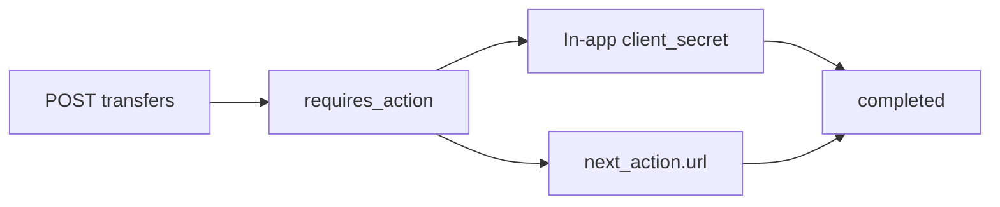

A transfer sends from a customer **vault** to a [payment method](/send). Prefer quote-then-transfer so the amounts are locked.

Your secret key creates the transfer. It does not move the vault. The customer reviews and authorizes — in your app with the `client_secret`, or on the hosted URL.

<Note>
  **Scope:** `POST` create and cancel need `transfers.write`. `GET` needs `accounts.read`. Confirm uses the `client_secret`, not a merchant key.
</Note>

Send restrictions apply. A restricted business cannot create transfers.

## Object

| Field | Type | Notes |
|---|---|---|
| `id` | string | `tr_…` |
| `quote` | string \| null | `qt_…` |
| `source` | string \| null | `acct_…` |
| `destination` | string \| null | `dest_…` |
| `amount` | integer | Cents held, then debited on confirm |
| `currency` | string | |
| `status` | string | `requires_action`, `completed`, `failed`, `canceled` |
| `expires_at` | string \| null | Quote expiry or 15 minutes, whichever is sooner |
| `next_action` | object \| null | `{ "type": "authorize", "url": "…" }` while `requires_action` |
| `client_secret` | string | `easner_ta_…`. Returned **once** on create |
| `livemode` | boolean | |
| `created` | ISO-8601 | |

```json
{
  "id": "tr_…",
  "quote": "qt_…",
  "source": "acct_…",
  "destination": "dest_…",
  "amount": 4900,
  "currency": "USD",
  "status": "requires_action",
  "expires_at": "2026-09-20T00:15:00.000Z",
  "next_action": {
    "type": "authorize",
    "url": "https://business.easner.com/send/authorize/tr_…?client_secret=easner_ta_test_…"
  },
  "client_secret": "easner_ta_test_…",
  "livemode": false,
  "created": "2026-09-20T00:00:00.000Z"
}
```

Create locks `available` into `pending`. Confirm clears pending and sends. Expire, fail, or cancel releases the hold.

## Create from a quote

Always send `Idempotency-Key`.

```bash
curl https://api.easner.com/v1/transfers \
  -H "Authorization: Bearer $EASNER_SECRET_KEY" \
  -H "Content-Type: application/json" \
  -H "Idempotency-Key: $(uuidgen)" \
  -d '{"quote":"qt_…"}'
```

`201` `requires_action`. Pass `client_secret` to your user session. Do not confirm with the secret key.

A replay with the same idempotency key returns the same transfer **without** a new `client_secret`. Store the secret from the first response.

## Create without a quote

You may pass `source`, `destination`, `amount`, and `currency` instead of `quote`. Prefer a quote when the destination can change receive amounts.

## Confirm

After `201` `requires_action`, the customer must authorize. Two paths — same secret.



### In-app

Pass `client_secret` to your user session. Show `amount`, `currency`, and a masked destination. Review:

```bash
curl https://api.easner.com/v1/transfers/tr_… \
  -H "Authorization: Bearer easner_ta_…"
```

```json
{
  "id": "tr_…",
  "quote": "qt_…",
  "source": "acct_…",
  "destination": "dest_…",
  "amount": 4900,
  "currency": "USD",
  "status": "requires_action",
  "livemode": false,
  "created": "2026-09-20T00:00:00.000Z",
  "expires_at": "2026-09-20T00:15:00.000Z",
  "next_action": {
    "type": "authorize",
    "url": "https://business.easner.com/send/authorize/tr_…"
  },
  "destination_summary": { "type": "easetag", "label": "@ada" }
}
```

`destination_summary.label` is masked (last four of account / IBAN / phone / wallet, or `@tag`). No `client_secret` on this response.

Then confirm — **no** `easner_sk_*`:

```bash
curl https://api.easner.com/v1/transfers/tr_…/confirm \
  -H "Content-Type: application/json" \
  -d '{"client_secret":"easner_ta_…"}'
```

You can also send `Authorization: Bearer easner_ta_…` with an empty or omitted body secret. A merchant key returns `403` `customer_action_required`. Replay after `completed` returns the same transfer.

### Hosted URL

Open `next_action.url` (includes the secret). Same review and confirm, hosted.

Test confirm debits the test book. Live confirm sends from the customer vault.

Fulfil from `transfer.completed`, not from create `201`. Tick `transfer.failed` if you handle expiry or rail failure.

## Cancel

Secret key, only while `requires_action`. Releases the hold. Already `canceled` returns the same transfer.

```bash
curl https://api.easner.com/v1/transfers/tr_…/cancel \
  -H "Authorization: Bearer $EASNER_SECRET_KEY" \
  -X POST
```

## Retrieve and list

`GET /v1/transfers/:id` → Transfer. `404` if missing. Merchant GET never returns `client_secret`. Review (`destination_summary`) needs Bearer `easner_ta_…`.

`GET /v1/transfers` → `{ "data": [ Transfer, … ] }` newest first, up to 100. There is no next page.

## Status

| Status | Expected |
|---|---|
| `requires_action` | Created and locked. Webhook `transfer.created`. Customer must confirm |
| `completed` | Vault sent. Webhook `transfer.completed` |
| `failed` | Hold released, or send rolled back. Webhook `transfer.failed` |
| `canceled` | You canceled before confirm. Hold released |

## Events

| Event | `data` |
|---|---|
| `transfer.created` | The transfer (no `client_secret`) |
| `transfer.completed` | The transfer |
| `transfer.failed` | Transfer plus `error` |
| `transaction.created` | The ledger row |
| `account.updated` | New available / pending |

<Warning>
  Fulfil on `transfer.completed`, not on the HTTP `201` from create.
</Warning>

<Card title="Transactions" icon="receipt" href="/transactions">
  Reconcile sends and receives against `GET /v1/transactions`.
</Card>
