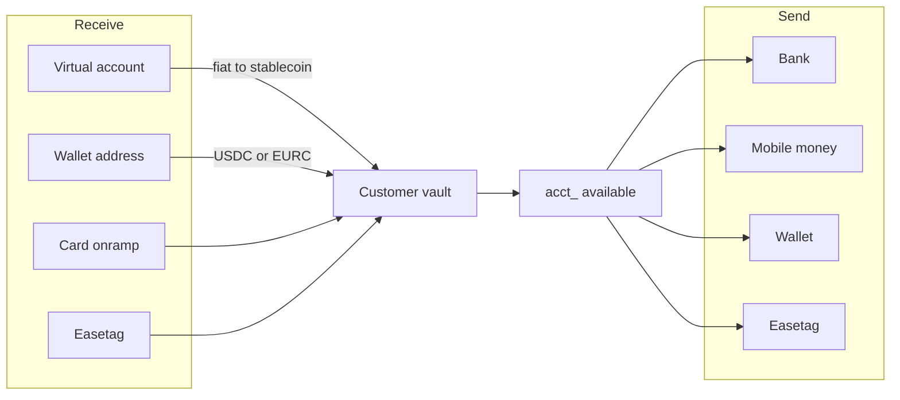

You integrate. Your customer is the banking end user (`cus_`). A payer is someone who pays you through Checkout.

Every issued account is that customer’s **isolated stablecoin vault** with a currency view:

| Account | Vault asset | Chain |
|---|---|---|
| USD `acct_` | USDC | Solana |
| EUR `acct_` | EURC | Solana |

The funds sit in **their** vault — a dedicated on-chain address for that `cus_`. They do not land on Easner’s balance and they do not land on yours. Easner does not operate that vault and does not move money out of it on a merchant key. The customer authorizes the send from their vault. Fiat in converts into the vault. `available` is the vault, in cents.

## Two products

| Product | Who holds the money | What you build |
|---|---|---|
| **Banking** | Your customer, in their vault (`acct_`) | [Customers](/customers), [Accounts](/accounts), [Receive](/receive), [Send](/send) |
| **Checkout** | You, on your business balance | [Collect](/checkout) on your website |

They share a secret key and Console. They do not share a balance.

Checkout collects onto **your** business balance — the same balance as invoices and payment links, not a customer vault. That is not Receive.

## KYB you, KYC them

Your entity verifies in Banking → Settings (KYB). That is not a `cus_`. Licensed partners provide verification. Then `POST /v1/customers` with your `external_id` maps **your user → `cus_` → `acct_`**.

`POST /v1/customers/:id/verification` is personal KYC for that `cus_`. Test approves immediately. Live returns a hosted URL. A name and email alone cannot hold a named virtual account. See [Customers](/customers).

## Console and Banking

Console is the developer portal. Banking is the operator app. Switch between them in the account menu.

Open Console on `business.easner.com`. Stay in **Test** until you have gone through [Test and live](/test-and-live). The Test / Live switch in the header applies to customers, payments, accounts, and Checkout.

Mint keys and add webhook URLs from Console Settings (API keys, Webhooks). Inspect `cus_`, `acct_`, `txn_`, and `cs_` in Console. First-party send, cards, and collections stay in Banking.

## How you integrate

<Steps>
  <Step title="KYB yourself, then create the customer">
    Banking → Settings (KYB), then `POST /v1/customers`. This issues a USD vault and account. Open EUR with `POST /v1/accounts`.
  </Step>
  <Step title="KYC the customer before live rails">
    `POST /v1/customers/:id/verification`. See [Customers](/customers).
  </Step>
  <Step title="Receive into the vault">
    Publish [bank details](/receive#virtual-account), a [wallet address](/receive#wallet-address), or a [card onramp](/receive#card-onramp). Listen for `account.updated` and `transaction.created`.
  </Step>
  <Step title="Send from the vault">
    [Destination](/destinations), [quote](/quotes) with `source`, [transfer](/transfers). The customer authorizes. Fulfil from `transfer.completed`.
  </Step>
  <Step title="Collect on your site">
    Optional. [Checkout](/checkout) sessions credit **your** business balance. Fulfil from `checkout.completed`.
  </Step>
</Steps>

## Objects

| Object | Id | Product | Job |
|---|---|---|---|
| Customer | `cus_` | Banking | Your end user. Owns the vault |
| Account | `acct_` | Banking | Currency view of that vault |
| Destination | `dest_` | Banking | Payment method for a send |
| Quote | `qt_` | Banking | Locked send / receive amounts |
| Transfer | `tr_` | Banking | Money leaving the vault |
| Transaction | `txn_` | Both | Activity on `GET /v1/transactions` |
| Checkout session | `cs_` | Checkout | A collect on your website |

Easner Group, Inc. ("Easner") is a financial technology company, not a bank or investment adviser. Banking, payment, verification, and card services available are provided by licensed partners. Easner does not provide investment, legal, tax, or financial advice.
