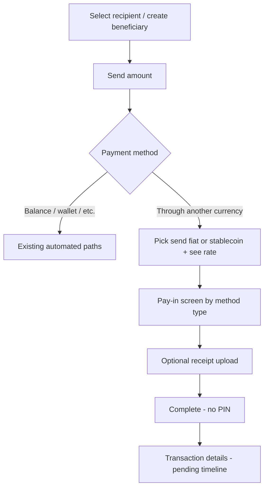

# Manual send — “Through another currency”

Product and implementation plan for **manual** cross-border send on **Business** and **Mobile**.

**Out of scope:** balance send, Easenet P2P, automated Noah/Yellowcard wallet execution, logistics/cash delivery.

---

## What “receive options” was **not**

There is **no separate “receive currency” step** in the manual flow.

- **Receive currency** = `recipient.currency`, set when the user **creates or selects a recipient** (e.g. Senegal beneficiary → `XOF`).
- On **Send amount**, the app already knows `recipient.currency`. The quote uses:
  - **Send (pay-in) currency** — chosen under **Through another currency** (from Rates ∩ Payment methods).
  - **Receive currency** — `recipient.currency` (fixed earlier).

Backend must have an active **`exchange_rates`** row:

`from_currency = sendCurrency` → `to_currency = recipient.currency`

If that row is missing, show an error on the amount screen (do not offer a second picker for receive).

---

## User journey (Mobile — canonical; Business similar)



### Step 1 — Recipient (receive currency fixed here)

| Screen | Purpose |
|--------|---------|
| `SelectRecentRecipientScreen` / `SelectRecipientScreen` | Pick or create recipient; **`recipient.currency`** is set here (e.g. `XOF` for Senegal). |

No Fiat/Crypto tab involved. Corridor rules may still apply when **creating** a beneficiary (product rules), but manual pricing does **not** use a separate receive picker later.

### Step 2 — Amount + Through another currency

| Screen | Purpose |
|--------|---------|
| `SendAmountScreen` | Enter amount (send- or receive-led, same as today). Select **Through another currency**. |

**UI behaviour (keep layout; change data source only):**

- Under **Through another currency**, show **send / pay-in currencies** from **Rates ∩ Payment methods** (USD, USDC, RUB, … — not from `send-destinations` / Fiat tab).
- After send currency is chosen, show **all active `payment_methods` for that currency** (e.g. KES → M-Pesa, Bank Transfer) using each row’s `name`. User selection sets `payment_method_id` and routes to the matching pay-in screen by `type`.
- If only one active PM exists, auto-select it.

**Rate display (same place as today’s API rate line):**

- When **Through another currency** + send currency selected, show rate using **`fxEngine`** + **`exchange_rates`** for pair **`sendCurrency → recipient.currency`**.
- Show fee and **total to pay** when manual quote applies (not Noah).
- Rest of amount UI unchanged (balance line, keypad, etc.).

### Step 3 — Pay-in instructions

Navigate by **payment method type** (existing screens; wire to **`payment_methods`** from DB):

| `payment_methods.type` (or mapped rail) | Mobile screen | Business |
|----------------------------------------|---------------|----------|
| `bank_account` / `bankTransfer` | `VirtualBankAccountScreen` | `/send/authorize/bank-transfer` |
| `mobile_money` / `mpesa` / `mtnMomo` | `MobileMoneyScreen` | `/send/authorize/mobile-money` |
| Open banking / `sbp` | `OpenBankingScreen` | `/send/authorize/open-banking` |
| **`stablecoin`** | `StablecoinScreen` (or dedicated manual stablecoin pay-in) | `/send/authorize/stablecoin` |

**Replace hardcoded `getBankDetails()`** with **`GET /api/payment-methods?currency={sendCurrency}`** (default active method).

Show: amount breakdown, **reference** (transaction id / reference code), copy fields (account, IBAN, wallet address, QR, etc.).

### Step 4 — Receipt + complete

| Screen | Purpose |
|--------|---------|
| Same pay-in screen | **Optional receipt** upload (image/PDF). |
| **Complete** CTA | **No PIN** for manual path. |

**On Complete:**

1. **`POST /api/manual-send/orders`** (or equivalent) with frozen quote snapshot, `recipient_id`, `payment_method_id`, optional receipt.
2. Create **`transactions`** row `status: pending` (or `processing`).
3. Navigate to **Transaction details** with timeline/status (existing `TransactionDetails`).

**Today’s gap:** `VirtualBankAccountScreen` (and similar) only `navigation.replace('TransactionDetails')` with client-generated id — **no API create**, hardcoded bank details, receipt upload TODO.

---

## Platform control (manual vs automated)

| Tabs | Role |
|------|------|
| **Rates** | Manual pricing for **fiat + stablecoins** (`exchange_rates`, fees, min/max, `can_send`). |
| **Payment methods** | Pay-in per **send currency** (bank, QR, stablecoin wallet, mobile money). Required for currency to appear under Through another currency. |
| **Fiat** + **Crypto** | **Automated send only** (Noah, Yellowcard, wallet). |

**Through another currency send currency list:**

```
distinct active exchange_rates.from_currency
  ∩ active payment_methods.currency
```

**Rate pair for quote (not a UI list):**

```
exchange_rates where from = sendCurrency AND to = recipient.currency
```

---

## Decisions (locked)

| Topic | Decision |
|--------|----------|
| Receive currency UI | **None** — use `recipient.currency` from recipient step |
| Send currency UI | **Rates ∩ Payment methods** on Send amount under Through another currency |
| Quote | `fxEngine` + `exchange_rates` for `sendCurrency → recipient.currency` |
| Pay-in | `payment_methods` for `sendCurrency` on pay-in screens |
| Complete | No PIN; API creates pending transaction + optional receipt |
| Fiat / Crypto tabs | Automated only |

---

## Implementation phases (revised)

### Phase 0 — Catalog + validation (1–2 days)

1. **`buildManualSendPayInCurrencies({ exchangeRates, paymentMethods, currencies })`** — list for Through another currency picker only.
2. **`fxEngine.validateRate(rates, sendCurrency, recipient.currency)`** — gate Continue / show rate (replace **`buildManualReceiveCurrencies`** — not a user-facing list).
3. Optional **`GET /api/manual-send/catalog`** returning send currencies + rates list for apps.
4. Mobile/Business: load send currencies from API; **stop** using `buildOtherSendCurrencies` for manual path.

### Phase 1 — Quote on amount screen (3–5 days)

- **`POST /api/fx/manual-quote`** — `direction`, `amount`, `fromCurrency`, `toCurrency` (= `recipient.currency`).
- **SendAmountScreen** / **business send page**: when `otherCurrency`, use manual quote; show rate line, fee, total to pay in **existing** rate area.
- Balance / wallet paths unchanged (Noah where applicable).

### Phase 2 — Validation (2–3 days)

- Min/max on amount blur (send currency).
- Block Continue if no rate row or no payment method for send currency.

### Phase 3 — Pay-in screens (3–4 days)

- **`GET /api/payment-methods?currency=…&for=manual_send`**
- Wire **VirtualBankAccount**, **MobileMoney**, **OpenBanking**, **Stablecoin** (and business authorize pages) to PM rows.
- **Stablecoin manual pay-in:** use `payment_methods` (wallet, network, QR) — not Noah deposit address fetch unless type is `provider`.

### Phase 4 — Complete order + transaction details (5–7 days)

- **`POST /api/manual-send/orders`** — snapshot, `reference_code`, receipt to storage, `pending` transaction.
- **Complete** on pay-in screens calls API then **`TransactionDetails`** with real id + timeline.
- Remove client-only `transactionId` navigation without persist (or map client id to server reference).

### Phase 5 — Ops

- Rate sync cron; Office “Last rates update”; schema support for stablecoin codes on Rates (e.g. USDC).

---

## Path coexistence

| Path | Pricing | Pay-in | Complete |
|------|---------|--------|----------|
| Balance / P2P | Ledger | — | PIN / ledger |
| Wallet USDC/USDT | Noah | Noah | Automated |
| Corridor automated | Provider | Provider | Provider |
| **Through another currency** | **exchange_rates** | **payment_methods** | **Pending + receipt, no PIN** |

---

## Nigeria → Senegal example

1. Create recipient with currency **XOF** (Senegal).
2. Send amount: Through another currency → **USD** (on Rates + USD payment method).
3. Rate line: **1 USD = … XOF** from `exchange_rates`; fee; total to pay in USD.
4. Continue → bank pay-in screen with **USD** `payment_methods` details + reference.
5. Upload receipt (optional) → **Complete** → pending transaction → **Transaction details**.

**Fiat tab** (SN corridor) is for **automated** provider payout, not for picking USD on the amount screen.

---

## Current code map (Mobile)

| Step | File | Gap |
|------|------|-----|
| Recipient | `SelectRecipientScreen`, `SelectRecentRecipientScreen` | OK — `recipient.currency` |
| Amount + other currency | `SendAmountScreen` | Noah quote; send list from send-destinations |
| Bank pay-in | `VirtualBankAccountScreen` | Hardcoded bank; no create order; receipt TODO |
| Mobile money | `MobileMoneyScreen` | Same pattern |
| Open banking | `OpenBankingScreen` | Same pattern |
| Stablecoin | `StablecoinScreen` | Noah address fetch — wire to manual PM for Rates+PM USDC |
| Details | `TransactionDetails` | Needs real pending tx from API |

Business: `business/app/send/page.tsx`, `authorize/*` — same gaps.

---

## Build order

1. Phase 0 + 1 — send currency list + quote on amount screen.  
2. Phase 3 — pay-in from DB.  
3. Phase 4 — complete + transaction details.  
4. Phase 2 + 5 — validation + cron/schema.

---

## Related code

| Piece | Location |
|-------|----------|
| FX engine | `packages/shared/src/fx-engine.ts` |
| Rate sync | `packages/rate-sync/` |
| Office Rates / PM | `office-rates-panel`, `office-payment-methods-panel` |
| Mobile flow | `mobile/src/screens/send/*` |
| Business flow | `business/app/send/*` |
